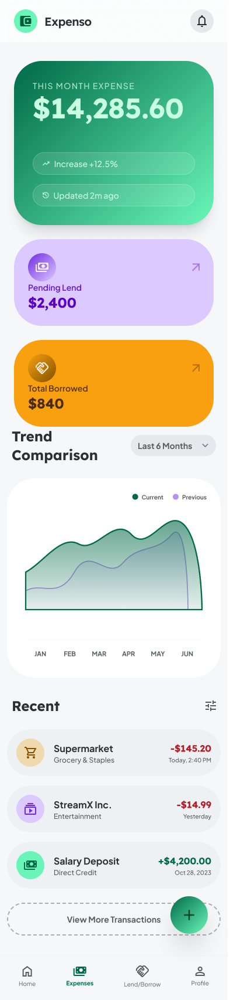

# Expenso — Expense Tracking App

## 📌 Overview

**Expenso** is a personal finance management app that helps users track their daily expenses, manage borrow/lend transactions with friends & family, and monitor credit card utilization. The app uses **Supabase** as the backend for authentication, database, and real-time sync.

---

## 🧩 Core Modules

| # | Module                  | Description                                                    |
|---|-------------------------|----------------------------------------------------------------|
| 1 | **Authentication**      | Register / Login with phone number & password                  |
| 2 | **Expense Tracking**    | Add, edit, delete daily expenses with category, source & notes |
| 3 | **Borrow / Lend**       | Track money given to or taken from friends/family              |
| 4 | **Settlement**          | Settlement is a type within Borrow/Lend records                |
| 5 | **Credit Card Tracker** | Track credit card transactions and utilization                 |
| 6 | **Friends Management**  | Add friends manually or sync from contacts                     |
| 7 | **Categories & Sources**| User-defined categories and payment sources                    |
| 8 | **Dashboard / Reports** | Visual summary with charts and filters                         |

---

## 🔐 Module 1 — Authentication

### 1.1 Registration Screen
**Route:** `/register`

| Field        | Type     | Validation                          |
|--------------|----------|-------------------------------------|
| Full Name    | Text     | Required, min 2 chars               |
| Phone Number | Phone    | Required, 10 digits, unique         |
| Password     | Password | Required, min 6 chars               |

- After successful registration → navigate to **Home/Dashboard**.
- Store auth token locally using `GetStorage`.

### 1.2 Login Screen
**Route:** `/login`

| Field        | Type     | Validation              |
|--------------|----------|-------------------------|
| Phone Number | Phone    | Required, 10 digits     |
| Password     | Password | Required                |

- On success → navigate to **Home/Dashboard**.
- "Don't have an account? Register" link at the bottom.

### 1.3 Auth Flow
```
App Launch
   │
   ├── Token exists & valid? ──→ Home/Dashboard
   │
   └── No token? ──→ Login Screen
                         │
                         ├── Login Success ──→ Home/Dashboard
                         │
                         └── Register Link ──→ Register Screen
                                                  │
                                                  └── Register Success ──→ Home/Dashboard
```

---

## 💰 Module 2 — Expense Tracking

### 2.1 Add/Edit Expense Screen
**Route:** `/expense/add` | `/expense/edit/:id`

| Field    | Type          | Validation                              |
|----------|---------------|-----------------------------------------|
| Amount   | Number        | Required, > 0                           |
| Category | Dropdown      | Required, select from list or add new   |
| Date     | Date Picker   | Required, defaults to today             |
| Source   | Dropdown      | Required (e.g., Paytm, PhonePe, Cash)   |
| Note     | Text          | Optional, max 200 chars                 |

**Inline Add:**
- If the desired **category** doesn't exist → show "**+ Add Category**" option inside the dropdown → opens a bottom sheet to add a new category (name + icon/color).
- If the desired **source** doesn't exist → show "**+ Add Source**" option inside the dropdown → opens a bottom sheet to add a new source (name + icon).

### 2.2 Expense List Screen
**Route:** `/expenses`

- List of all expenses grouped by date (today, yesterday, this week, etc.) by month wise  at top of list month will show and next and previous month button will be there.
- Each card shows: **amount**, **category icon**, **category name**, **source**, **note preview**
- Swipe left to **delete**, tap to **edit**
- Filter by: date range, category, source
- Sort by: date (newest/oldest), amount (high/low)


---

## 🤝 Module 3 — Borrow / Lend

### 3.1 Add Borrow/Lend Record Screen
**Route:** `/transaction/add`

| Field        | Type          | Validation                                         |
|--------------|---------------|-----------------------------------------------------|
| Type         | Toggle        | Required — **"I Lent"** or **"I Borrowed"**          |
| Amount       | Number        | Required, > 0                                        |
| With Whom    | Friend Picker | Required — select existing friend or add new         |
| Category     | Dropdown      | Required, select from list or add new                |
| Note         | Text          | Optional                                             |
| Date         | Date Picker   | Required, defaults to today                          |
| Return Date  | Date Picker   | Optional — expected date of return                   |

**Friend Picker Logic:**
```
Tap "With Whom" field
   │
   ├── Show list of existing friends (searchable)
   │
   ├── "+ Add Friend" button
   │       │
   │       ├── Enter Name + Phone Number manually
   │       │
   │       └── OR "Pick from Contacts" → opens phone contacts
   │
   └── Select friend → populate field
```

### 3.2 Borrow/Lend List Screen
**Route:** `/transactions`

- Two tabs: **"I Lent"** | **"I Borrowed"**
- Each card shows: **friend name**, **amount**, **date**, **return date** (if set), **status** (Pending / Settled / Partially Settled)
- Tap a record → view details with settlement history
- **Summary bar at top:** Total Lent | Total Borrowed | Net Balance

### 3.3 Settlement Screen
**Route:** `/transaction/settle/:id`

| Field  | Type   | Validation                                         |
|--------|--------|-----------------------------------------------------|
| Amount | Number | Required, > 0, ≤ remaining balance                  |
| Date   | Date   | Required, defaults to today                          |
| Note   | Text   | Optional                                             |

- Allows **partial settlement** (e.g., lent ₹1000, friend returns ₹400 now)
- Settlement history shown below the form
- Auto-update status: Pending → Partially Settled → Settled

---

## 💳 Module 4 — Credit Card Tracker

### 4.1 Add Credit Card (One-time Setup)
**Route:** `/credit-card/add`

| Field          | Type   | Validation        |
|----------------|--------|-------------------|
| Card Name      | Text   | Required          |
| Credit Limit   | Number | Required, > 0     |
| Billing Date   | Number | 1–31              |
| Last 4 Digits  | Text   | Optional, 4 chars |

### 4.2 Add Credit Card Transaction
**Route:** `/credit-card/transaction/add`

| Field    | Type          | Validation                            |
|----------|---------------|---------------------------------------|
| Card     | Dropdown      | Required, select from user's cards    |
| Amount   | Number        | Required, > 0                         |
| Category | Dropdown      | Required, select from list or add new |
| Date     | Date Picker   | Required, defaults to today           |
| Used By  | Friend Picker | Optional — self or a friend           |
| Note     | Text          | Optional                              |

### 4.3 Credit Card Dashboard
**Route:** `/credit-cards`

- List of all credit cards with:
  - **Utilization bar** (used / limit)
  - **Used amount** / **Available amount**
  - **Billing cycle progress**
- Tap a card → view all transactions for that card
- Filter transactions by: date range, category, used by

---

## 👥 Module 5 — Friends Management

### 5.1 Friends List Screen
**Route:** `/friends`

| Friend Card Shows            |
|------------------------------|
| Name                         |
| Phone Number                 |
| Net Balance (owes me / I owe)|
| Number of pending transactions|

### 5.2 Add Friend
**Method:** Bottom Sheet

| Field        | Type  | Validation                  |
|--------------|-------|-----------------------------|
| Name         | Text  | Required                    |
| Phone Number | Phone | Required, 10 digits, unique |

- Option to **"Pick from Contacts"** → native contact picker
- Friends don't need to be registered app users

### 5.3 Friend Detail Screen
**Route:** `/friend/:id`

- All borrow/lend transactions with this friend
- Settlement history
- Net balance summary
- Credit card transactions where this friend used the card

---

## 🏷️ Module 6 — Categories & Sources

### 6.1 Default Categories (Pre-seeded)

| Category       | Icon               |
|----------------|--------------------|
| Food & Dining  | 🍔 restaurant      |
| Transport      | 🚗 directions_car  |
| Shopping       | 🛍️ shopping_bag   |
| Bills & Recharge| 📱 phone          |
| Entertainment  | 🎬 movie           |
| Health         | 💊 medical         |
| Education      | 📚 school          |
| Rent           | 🏠 home            |
| Salary/Income  | 💰 account_balance |
| Personal       | 👤 person          |
| Others         | 📦 category        |

### 6.2 Default Sources (Pre-seeded)

| Source       | Icon              |
|--------------|-------------------|
| Cash         | 💵 money          |
| Paytm        | 📱 phone_android  |
| PhonePe      | 📲 smartphone     |
| Google Pay   | 💳 payment        |
| Bank Transfer| 🏦 account_balance|
| Credit Card  | 💳 credit_card    |
| UPI          | 📡 contactless    |
| Others       | 📦 category       |

### 6.3 Manage Categories/Sources Screen
**Route:** `/settings/categories` | `/settings/sources`

- List all categories/sources
- Add new, edit name/icon, delete (only custom ones, not defaults)
- Reorder (optional, nice-to-have)

---

## 🏠 Module 7 — Dashboard (Home Screen)




## 👤 Module 8 — Profile & Settings

### 8.1 Profile Screen
**Route:** `/profile`

- User info (name, phone)
- Logout

---

## 🗂️ Data Models

### User
```dart
class User {
  String id;
  String name;
  String phone;
  String password; // hashed
  DateTime createdAt;
}
```

### Expense
```dart
class Expense {
  String id;
  String userId;
  double amount;
  String categoryId;
  String sourceId;
  DateTime date;
  String? note;
  DateTime createdAt;
  DateTime updatedAt;
}
```

### BorrowLend (Transaction)
```dart
class BorrowLendRecord {
  String id;
  String userId;
  String type;          // 'lend', 'borrow', or 'settlement'
  double amount;        // amount is also used for settlement amount..
  String friendId;
  String categoryId;
  String? note;
  DateTime date;
  DateTime? returnDate;
  String status;        // 'pending', 'partial', 'settled'
  DateTime createdAt;
  DateTime updatedAt;
}
```

### CreditCard
```dart
class CreditCard {
  String id;
  String userId;
  String cardName;
  double creditLimit;
  int billingDate;
  String? lastFourDigits;
  DateTime createdAt;
}
```

### CreditCardTransaction
```dart
class CreditCardTransaction {
  String id;
  String userId;
  String creditCardId;
  double amount;
  String categoryId;
  DateTime date;
  String? usedByFriendId; // null = self
  String? note;
  DateTime createdAt;
  DateTime updatedAt;
}
```

### Friend
```dart
class Friend {
  String id;
  String userId;        // owner
  String name;
  String phone;
  bool isSyncedFromContact;
  DateTime createdAt;
}
```

### Category
```dart
class Category {
  String id;
  String name;
  String icon;          // Material icon name
  String color;         // Hex color
  bool isDefault;       // true = pre-seeded, can't delete
  String? userId;       // null for defaults, userId for custom
  DateTime createdAt;
}
```

### Source
```dart
class Source {
  String id;
  String name;
  String icon;
  bool isDefault;
  String? userId;
  DateTime createdAt;
}
```

---

## 📱 Screen Map & Navigation

### Bottom Navigation Bar (5 tabs)

| Tab      | Icon              | Screen                |
|----------|-------------------|-----------------------|
| Home     | 🏠 home           | Dashboard             |
| Expenses | 💰 account_balance| Expense List          |
| Lend     | 🤝 handshake      | Borrow/Lend List      |
| Profile  | 👤 person          | Profile & Settings    |


### Complete Screen List

| #  | Screen                        | Route                          |
|----|-------------------------------|--------------------------------|
| 1  | Splash Screen                 | `/`                            |
| 2  | Login Screen                  | `/login`                       |
| 3  | Register Screen               | `/register`                    |
| 4  | Home / Dashboard              | `/home`                        |
| 5  | Expense List                  | `/expenses`                    |
| 6  | Add/Edit Expense              | `/expense/add`                 |
| 7  | Borrow/Lend List              | `/transactions`                |
| 8  | Add Borrow/Lend               | `/transaction/add`             |
| 9  | Transaction Detail            | `/transaction/:id`             |
| 11 | Credit Card List              | `/credit-cards`                |
| 12 | Add Credit Card               | `/credit-card/add`             |
| 13 | Credit Card Transactions      | `/credit-card/:id/transactions`|
| 14 | Add CC Transaction            | `/credit-card/transaction/add` |
| 15 | Friends List                  | `/friends`                     |
| 17 | Profile Screen                | `/profile`                     |
| 18 | Manage Categories             | `/settings/categories`         |
| 19 | Manage Sources                | `/settings/sources`            |

---

## 🔄 App Flow

> **UI screens and flow diagrams will be shared separately during implementation.**

---

## 🏗️ Technical Architecture

### Tech Stack
| Layer             | Technology                     |
|-------------------|--------------------------------|
| Framework         | Flutter                        |
| State Management  | GetX                           |
| Backend           | **Supabase** (Auth, Database, Storage, Realtime) |
| Local Storage     | GetStorage (offline cache)     |
| HTTP Client       | supabase_flutter               |
| Charts            | fl_chart                       |
| Fonts             | Google Fonts (Poppins)         |
| Responsive        | flutter_screenutil             |
| UUID              | uuid package                   |
| Connectivity      | connectivity_plus              |

### Folder Structure
```
lib/
├── main.dart
├── bindings/
│   ├── general_binding.dart
│   ├── auth_binding.dart
│   ├── expense_binding.dart
│   ├── transaction_binding.dart
│   └── credit_card_binding.dart
├── controllers/
│   ├── auth_controller.dart
│   ├── dashboard_controller.dart
│   ├── expense_controller.dart
│   ├── borrow_lend_controller.dart
│   ├── credit_card_controller.dart
│   ├── friend_controller.dart
│   ├── category_controller.dart
│   └── source_controller.dart
├── models/
│   ├── user_model.dart
│   ├── expense_model.dart
│   ├── borrow_lend_model.dart
│   ├── credit_card_model.dart
│   ├── credit_card_transaction_model.dart
│   ├── friend_model.dart
│   ├── category_model.dart
│   └── source_model.dart
├── repositories/
│   ├── auth_repository.dart
│   ├── expense_repository.dart
│   ├── borrow_lend_repository.dart
│   ├── credit_card_repository.dart
│   ├── friend_repository.dart
│   ├── category_repository.dart
│   └── source_repository.dart
├── screens/
│   ├── auth/
│   │   ├── login_screen.dart
│   │   └── register_screen.dart
│   ├── dashboard/
│   │   └── dashboard_screen.dart
│   ├── expense/
│   │   ├── expense_list_screen.dart
│   │   └── add_expense_screen.dart
│   ├── borrow_lend/
│   │   ├── borrow_lend_list_screen.dart
│   │   ├── add_borrow_lend_screen.dart
│   │   ├── transaction_detail_screen.dart
│   │   └── settlement_screen.dart
│   ├── credit_card/
│   │   ├── credit_card_list_screen.dart
│   │   ├── add_credit_card_screen.dart
│   │   ├── credit_card_transactions_screen.dart
│   │   └── add_cc_transaction_screen.dart
│   ├── friends/
│   │   ├── friends_list_screen.dart
│   │   └── friend_detail_screen.dart
│   ├── profile/
│   │   └── profile_screen.dart
│   └── settings/
│       ├── manage_categories_screen.dart
│       └── manage_sources_screen.dart
├── services/
│   ├── supabase_service.dart
│   ├── storage_service.dart
│   └── connectivity_service.dart
├── core/
│   ├── constants/
│   │   ├── colors.dart
│   │   ├── sizes.dart
│   │   └── api_constants.dart
│   ├── theme/
│   │   ├── app_theme.dart
│   │   └── app_colors.dart
│   └── utils/
│       └── validators.dart
├── utils/
│   ├── helpers/
│   ├── loader/
│   ├── popups/
│   └── theme/
├── widgets/
│   ├── common/
│   │   ├── custom_text_field.dart
│   │   ├── custom_button.dart
│   │   ├── custom_dropdown.dart
│   │   ├── date_picker_field.dart
│   │   ├── amount_input_field.dart
│   │   └── empty_state_widget.dart
│   ├── cards/
│   │   ├── expense_card.dart
│   │   ├── borrow_lend_card.dart
│   │   ├── credit_card_widget.dart
│   │   └── friend_card.dart
│   ├── bottom_sheets/
│   │   ├── add_category_sheet.dart
│   │   ├── add_source_sheet.dart
│   │   ├── add_friend_sheet.dart
│   │   └── add_transaction_type_sheet.dart
│   └── charts/
│       ├── expense_pie_chart.dart
│       └── utilization_bar.dart
└── routes/
    └── app_pages.dart
```

---

## 🚀 Implementation Phases

### Phase 1 — Foundation (Week 1)
- [x] Project setup (already done)
- [ ] Define all data models
- [ ] Set up routing (`app_pages.dart`)
- [ ] Build reusable widgets (text fields, buttons, dropdowns)
- [ ] Pre-seed default categories and sources
- [ ] Build auth screens (Login + Register)

### Phase 2 — Expense Module (Week 2)
- [ ] Expense controller & repository
- [ ] Add/Edit Expense screen
- [ ] Expense List screen with filters
- [ ] Category & Source management (add/edit/delete)

### Phase 3 — Borrow/Lend Module (Week 3)
- [ ] Friend management (add manually + contact picker)
- [ ] Add Borrow/Lend screen
- [ ] Borrow/Lend list with tabs
- [ ] Settlement flow (partial + full)
- [ ] Transaction detail screen

### Phase 4 — Credit Card Module (Week 4)
- [ ] Add Credit Card setup
- [ ] Credit Card transaction screen
- [ ] Credit Card dashboard with utilization
- [ ] "Used By" friend selection

### Phase 5 — Dashboard & Polish (Week 5)
- [ ] Dashboard with summary cards
- [ ] Pie/Donut chart for category breakdown
- [ ] Recent transactions feed
- [ ] Profile screen
- [ ] UI polish, animations, edge cases

---

## 🎨 Design Language

| Aspect          | Choice                                      |
|-----------------|---------------------------------------------|
| Primary Color   | `#7A8EE2` (Soft Indigo)                     |
| Secondary Color | `#D49A3D` (Warm Gold)                       |
| Font            | Poppins (via Google Fonts)                   |
| Background      | `#FAFBFF` (Off-white)                       |
| Cards           | White with subtle shadow, 16px border radius|
| Icons           | Material Icons                              |
| Animations      | Smooth page transitions, subtle card hover  |
| Charts          | fl_chart — Pie chart, Bar chart, Line chart |

---

## ✅ Acceptance Criteria

1. User can register and login with phone + password
2. User can add, edit, and delete expenses with category, source, date, and note
3. User can add custom categories and sources from within the add-expense flow
4. User can record borrow/lend transactions with friends
5. User can add friends manually (name + phone) or pick from contacts
6. User can settle borrow/lend records partially or fully
7. User can add credit cards and track transactions
8. User can see who used their credit card (self or friend)
9. Dashboard shows monthly expense summary, lend/borrow balance, and CC utilization
10. All data syncs to Supabase backend with local caching via GetStorage
11. Auth handled by Supabase Auth (phone + password)
